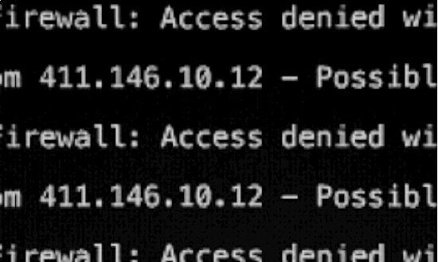

<h1 align="center">
  
</h1>

  
    

  <strong>
    <em>
      "The world is a dangerous place, not because of those who do evil, but because of those who look on and do nothing."
    </em>
  </strong>
    
  – Mr. Robot

---

  
  &nbsp;&nbsp;&nbsp;&nbsp;
  
  &nbsp;&nbsp;&nbsp;&nbsp;
  

---

## 🛠️ Skills

- **Network Security**: Firewalls, IDS/IPS, VPNs, VLANs
- **Offensive Security**: Pentesting, Vulnerability Scanning, Exploitation
- **Defensive Security**: SIEM Monitoring, Log Analysis, Threat Hunting
- **Scripting**: Python
- **Systems**: Linux Administration, Windows Hardening
- **General Networking**: Cisco, Mikrotik, Routers, Switches, Cabling, Diagrams, Topologies, Scripts, Network Design

---

## ⚡ Training (main courses)

- Cisco CCNA Introduction to Networks
- Cisco CCNA Swtiching, Routing and Wireless Essentials
- Cisco CCNA Enterprise Networking, Security and Automation
- Cisco CyberOps
- Cisco Network Security
- Information Security Assistant

---

## 🧰 Purple Shiva 🔱

- **Purple Shiva Tools**: Cybersecurity Tool created with the goal of helping those who are getting started in the cybersecurity world. This is a tool rich in docs, examples, usage and tutorials - simple to use and to modify. Read more about it <a href="https://github.com/PurpleShivaTeam/purpleshivatools" target="_blank">here</a>.
